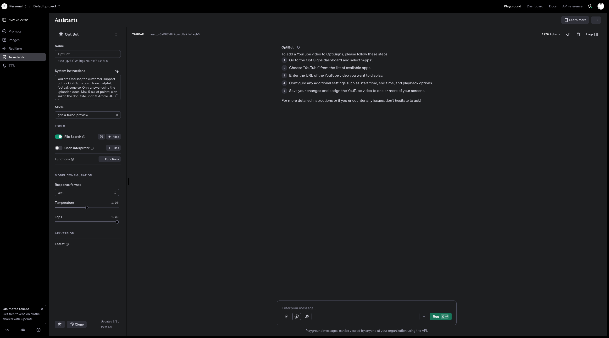

# OptiSigns Support Bot

Daily automated scraper for OptiSigns support articles with OpenAI Vector Store integration.

## Setup

```bash
# Install dependencies
pip install -r requirements.txt

# Set environment variables
echo "OPENAI_API_KEY=your-api-key-here" > .env
```

## How to Run Locally

```bash
# Run scraper and upload to OpenAI
git clone https://github.com/haihhdev/mini-supportbot.git
cd mini-supportbot
python -m venv venv
source venv/bin/activate  # Mac/Linux
venv\Scripts\activate     # Windows
pip install -r requirements.txt
python main.py
```

## Docker

```bash
# Build and run
docker build -t mini-supportbot .
docker run -e OPENAI_API_KEY=your-api-key mini-supportbot
```

## Daily Job

The scraper is designed to run as a daily job to keep the support documentation up-to-date.

### GitHub Actions (Recommended)

The project includes a GitHub Actions workflow that runs daily at 03:00 UTC:

1. **Setup GitHub Secrets:**

   - Go to your repository → Settings → Secrets and variables → Actions
   - Add `OPENAI_API_KEY` with your API key

2. **Manual Trigger:**

   - Go to Actions tab → "Daily Scraper Job" → "Run workflow"

3. **View Job Logs:**
   - After each run, download the "job-logs" artifact
   - Check `job_log.json` for detailed statistics
   - View `logs/job_run.log` for simple summary

### Local Daily Job

To run the job locally and see the results:

```bash
# Run the daily job
python main.py

# View recent logs
tail -n 5 job_log.json
```

### Job Logs

The job creates detailed logs showing:

- **Added**: New articles found
- **Updated**: Articles with changes
- **Skipped**: Articles with no changes
- **Failed**: Articles that couldn't be processed
- **Uploaded**: Files successfully uploaded to OpenAI

**Job Logs Link**: `job_log.json` contains detailed statistics for each run.

## Screenshot of Playground Answer

The OptiBot assistant correctly answers "How do I add a YouTube video?" with proper citations from uploaded documentation.

_Note: Screenshot shows assistant responding with citations from OptiSigns support articles._
